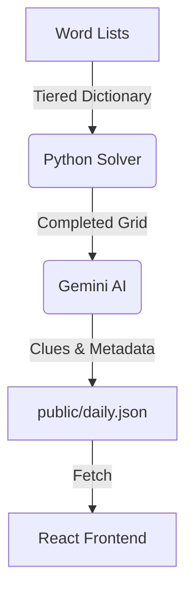

# Mini Crossword (Hybrid Engine)

A modern, daily mini-crossword puzzle application powered by a hybrid AI engine. It combines a deterministic constraint satisfaction solver for grid construction with a Large Language Model (Gemini) for creative clue generation.

## 🧩 Project Overview

This project implements a "Hybrid" approach to puzzle generation to solve the common pitfalls of LLM-only crossword creation (spatial reasoning failures).

- **The Architect**: A Python-based backtracking algorithm that places words into a grid using a tiered dictionary system (favoring common English words but falling back to complex ones if needed).
- **The Poet**: Google's Gemini AI, which takes the completed grid and writes witty, context-aware clues.
- **The Application**: A polished React frontend allowing users to play the daily generated puzzle.

## 🛠 Tech Stack

### Frontend
- **Framework**: React 19 + Vite
- **Styling**: Tailwind CSS v4
- **State Management**: Zustand
- **Validation**: Zod
- **Type Safety**: TypeScript

### Backend (Generation Engine)
- **Language**: Python 3
- **AI Model**: Google Gemini 2.0 Flash
- **Algorithm**: Constraint Satisfaction Problem (CSP) Solver with Forward Checking

## 🏗 Architecture

The generation pipeline ensures valid puzzles are created before they are surfaced to the UI.



## 🚀 Installation

### Prerequisites
- Node.js (v18+)
- Python 3.10+
- Google Gemini API Key

### 1. Backend Setup
Install the required Python dependencies:

```bash
pip install -r requirements.txt
```

Create a `.env` file in the root directory and add your API key:
```env
GEMINI_API_KEY=your_api_key_here
```

### 2. Frontend Setup
Install the Node.js dependencies:

```bash
npm install
```

## 📖 Usage

### Generate a New Puzzle
Run the Python script to build a new grid and generate clues. This will overwrite `public/daily.json`.

```bash
python scripts/generate_puzzle.py
```

### Start the Game
Run the development server to play the puzzle:

```bash
npm run dev
```

Open [http://localhost:5173](http://localhost:5173) in your browser.

## ✨ Key Features

- **Tiered Dictionary**: Prioritizes the 10,000 most common English words for approachable puzzles, but can access a full dictionary for difficult grid fills.
- **Smart Navigation**: Keyboard support for arrow keys, backspace, and tab navigation.
- **Responsive Design**: Mobile-friendly interface optimized for touch.
- **Win Detection**: Immediate validation upon puzzle completion.
